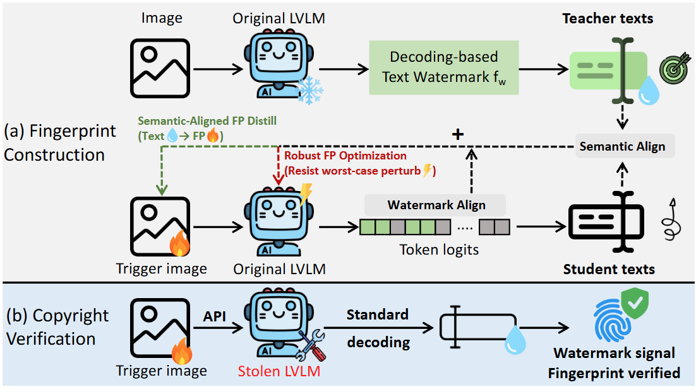

# SIF: Semantically In-Distribution Fingerprints for Large Vision-Language Models

This is the official implementation of the paper [SIF: Semantically In-Distribution Fingerprints for Large Vision-Language Models], which has been accepted to CVPR 2026.



### Setup

To install the necessary packages, first create a conda environment.
```
conda create -n <env_name> python=3.11
conda activate <env_name>
```
Then, install the required packages with 
```
pip install -r requirements.txt
```


### SIF

`sif.py` generates SIF fingerprints and contains the core fingerprinting logic.

Generate fingerprints:
```bash
bash generate.sh
```

Pre-generated fingerprints are stored in:
```
sif_fingerprint/
```

Run fingerprint detection:
```bash
bash fingerprint.sh
```

### Stealthiness Evaluation

Stealthiness evaluation is provided in the `stealthiness/` directory.  
Configure your OpenAI API key in `judge.sh`, then run:

```bash
bash judge.sh
```


### Parameter Learning Attack

The Parameter Learning Attack (PLA) is implemented in the `pla/` directory.

Run PLA:
```bash
bash pla/fingerprint.sh
```


